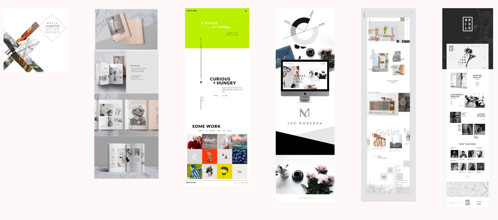
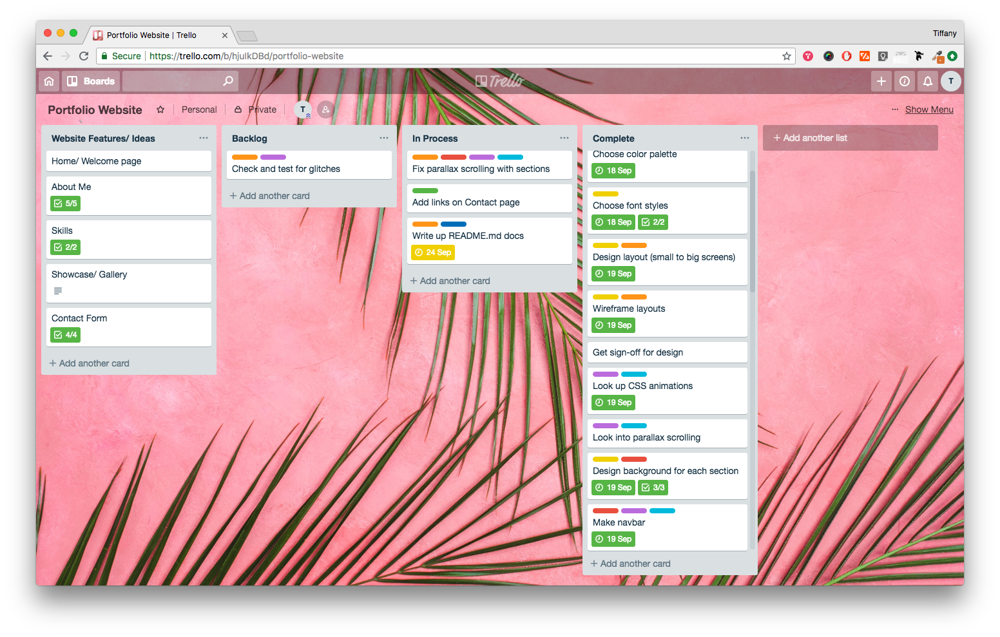
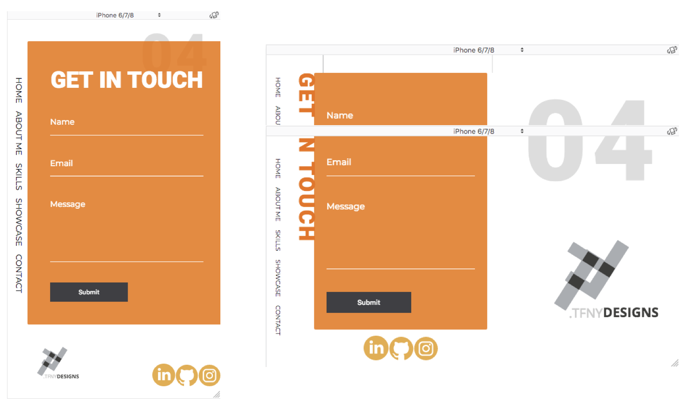
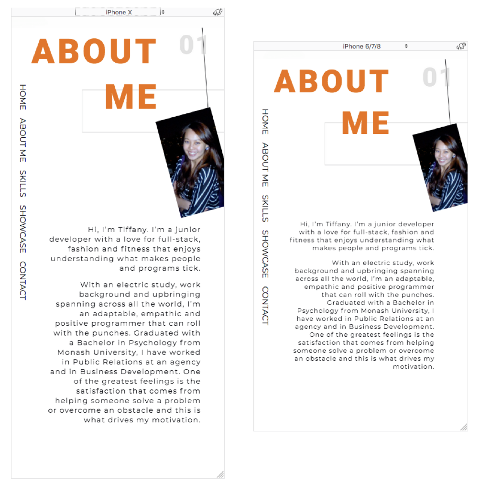

# Portfolio Website 
---
This portfolio website is my first website created from scratch in HTML and CSS. The process has been very fun and fulfilling from conceptualization and design down to coding and bringing my vision to life - in the browser.

Portfolio URL: https://tifffai.github.io/
Github Repository: https://github.com/tifffai/tifffai.github.io

---
# Contents
- [Portfolio Website](#portfolio-website)
- [Contents](#contents)
- [Purpose](#purpose)
        - [Target Audience](#target-audience)
        - [Site Map](#site-map)
- [Design Process](#design-process)
        - [Shapes and Lines Inspiration](#shapes-and-lines-inspiration)
        - [Layout Inspiration](#layout-inspiration)
        - [Color Scheme](#color-scheme)
        - [Font Planning](#font-planning)
        - [Personal Logo](#personal-logo)
        - [Wireframes](#wireframes)
        - [Project Management](#project-management)
        - [Considerations](#considerations)
- [Final Product](#final-product)
- [History & Theory of the Internet](#history--theory-of-the-internet)
        - [History of the Internet](#history-of-the-internet)
        - [Understanding Internet Domains, Web Servers, DNS, and Web Browsers](#understanding-internet-domains-web-servers-dns-and-web-browsers)
        - [The Internet's Impact on our Society](#the-internets-impact-on-our-society)

---

# Purpose
As a junior developer, this was my first step to make an impression on the type of programmer I want to become. Although inexperienced, I wanted to set the tone right and put my best foot forward. This portfolio captures my determination in going above and beyond basic briefs to produce projects beyond my initial capabilities. 

My portfolio was built on *HTML* and *CSS*, and to train my skills in using these two primary coding languages I restricted the use of any component libraries such as Bootstrap or SASS. To create this website a number of programs were used, including *Trello* for project management, *Git* to track and push project progress. *Figma, Vectr, Photoshop, Illustrator,* to design and structure the website. Finally, *VSCode* was used as the editor to code and build the website.

### Target Audience
This portfolio is for peers and potential employees or recruiters within and outside of the technology industry who are interested in my background. 

### Site Map
I wanted to create a modern website and kept the entire layout as a single page where one section flows into the next section succinctly. Below is a sitemap that doesn't strictly stick to the usual definition of sitemaps, since my website structure all lies within a single page, but sections can be visualised in the following way.

  

# Design Process
This is was a daunting process at the beginning but with the help of *Pinterest* and the internet, in general, I got lots of inspirations. In fact, at one point I had too much inspiration and had to really narrow in on the style and approach I was going to use. 

When I first went on Pinterest I was drawn towards a lot of design styles that had strong geometric lines, and angular shapes. I liked the minimalistic and clean sophisticated shapes and styles, and also geared towards simple manipulation of colors.  

### Shapes and Lines Inspiration 
 
During this process, I noticed I was particularly attracted to a lot of modular shaped architectural buildings, and interior designs with clean sleek lines. Especially when the shapes and angles were simplistic but were unexpected when they were off-kilter offering a different perspective.
 

### Layout Inspiration

Next step I looked around at a lot of websites for varying styles of webpage, posters, and also print material for layout style direction. Again, it was quite in-line with my previous appreciation for modular shapes and lines, that were not always perfectly centred and aligned. The unexpected blend and unclear progression from one section into another were stylish and elegant.
 

### Color Scheme

In the process of creating a color scheme that matched my aesthetics, I knew I definitely wanted to include some monochrome shades. However, I wanted to add a pop of colour as an accent to draw viewers attention. Going back to Pinterest, the color orange gradually emerged from the wood and tan interior design images which I adored. 

Looking at the psychology of color, orange brings to bite feelings of excitement, happiness, enthusiasm, and warmth. These were closely aligned with my personality and the impression I would want to share with viewers. Whilst real world application often uses this color to draw attention in traffic signs, which is perfect for an accent color which I intended to use it for.

I settled on an image of a gorgeous photograph of a long road ahead to pull my color scheme from. It felt was almost poetic and suited my theme perfectly, the road represented this journey I am on to becoming a developer. With this photograph below, I used *Adobe Color CC* to create my initial color palette.

I then proceeded to sample my color combinations and checked the color contrast ratios to match WCAG standards. This was a very difficult process because my main dark orange color (HEX #ED6400) only passes for large text WCAG AA. Thankfully I was only planning to use this accent color on headings so this colour scheme would still work. However, I spent a lot of time tweaking the shade hoping to find an orange tone that is WCAG AAA. But the ones that were, deviated too far from the style aesthetic I wanted for my webpage and was much too jarring and closer to brown than a lively pop of orange color. I even went online to look at other brands that use orange for their logos and color scheme and was really surprised none of them meets WCAG AAA standards. From this, I learnt that orange is a difficult color to use in the future if I wanted to adhere to the WCAG standards perfectly. I wouldn't have expected that considering it's often a color associated with grabbing attention. In the end, I chose an orange with a highest ratio orange shade that still suits the look and feel of the portfolio. 
 

### Font Planning
Choosing a font was much easier, I knew I wanted to use san-serif style throughout my webpage and wanted to incorporate 2 different fonts. One for the heading, and another for the smaller body of text. I was also sure I wanted to use Google fonts for wide compatibility across viewr browsers. I looked at some font pairings for inspiration done by others like the panels below, then tried a few styles out myself using my color scheme. With everything visualized, I quickly settled on using Roboto for my headings, and Montserrat for the rest of the text. I think having a clear direction with fonts made the process much more efficient.

 

 

### Personal Logo
Creating the logo was incredibly fun, in fact, it was one of the first things I started doodling around with. I mocked up a few logo designs using my initials, and the letters from my name and created different styles. Below are the mockups of my designs from left to right with some of the earlier ones to settling on 2 main designs that I liked and further refined on the right. Afterwards, I also integrated my color palette to try different iterations of them. 

Firstly, the logo on the top right side that is composed of two letters imitating transparency overlay was a refined design of the original bottom left design. I loved how the simple line of my initials T.F. matched up so well that create an almost hashtag-like symbol. Next, the circle design felt very versatile and adaptable. You can spell my full name using just the lines within the circle. In the end, to match the look and feel of my portfolio webpage, I chose one using just my initials. 

 

### Wireframes
When I started creating and designing the layout it became a very natural flow of how my webpage would piece together. I created multiple wireframes for a number of different screen sizes, including portrait and landscape mobile devices. The webpage would be all laid out on a single page, with links to different sections within that same page. I wrote notes to consider the various aspects I want to take note of when I was coding and building the page. 

On the left, I first started to design for portrait small mobile device first. I also graphically visualised how the interactions will play out from the navigation bar on the left on the top page would interact with the rest of the page sections. I wanted the navigation bar to stay fixed on the page if it was on the left side, but also tested to see how it would look if I have a navigation bar at the end of each section instead. My final design used the former method having a fixed bar on the left side, accessible throughout the viewer's experience. 

 

### Project Management 
I used Trello to project manage both the timeline and entire process, plus it helped me prioritize which tasks I had to tackle first, and assess what I had left to work on backlogged. I also used Git throughout the days to keep track of all progresses saved throughout the project. 

 

### Considerations
I have used Alt text in my images and tried to keep a clear navigation. However, for design and aesthetics, I didn't explicitly ask viewers to hover over the gallery images because it detracts from the design. There were many struggles when I was coding the website striking a balance between practicality and its design. The other consideration would be that some of the colours I've selected in the end are not WCAG AAA approval. 
  

# Final Product
I've been very excited and pleased with the final product that's been created. The website currently takes into consideration six levels of media queries for various screen; from varying mobile sizes, to a different orientation, to tablets and laptop screens. Incorporating CSS animations has been especially fun and satisfying, it's incredible how powerful CSS can be even on its own. The entire process has also been very educational, and gave me new confidence in being able to create something in its entirety from scratch. 

Some of the main challenges for me was when I wanted to first use parallax scrolling into my webpage. It was a very complex script with many varying layers, and with my lack of experience, it took me a long time to manage and start populating the website. That process took longer than I had initially planned, but the once I understood how to work with it, it was very satisfying. Another challenge was to constantly consider all a smooth user interface experience on various devices, the more I worked with media query the more I realised its difficult to fulfil so many screens when a website has a lot of moving components. Using CSS Grid really helped with this process and made it possible for me to create a truly responsive website. Another challenge was when I knew what feature I wanted to add into the website but realized that HTML and CSS alone wouldn't be able to accomplish it, I can't wait to learn more languages and update my portfolio in the near future.

Below are a few sample screenshots of my final portfolio website, and it shows how responsibe the portofolio webpage is for different screen sizes and orientations.

When the screen is smaller on mobile or small devices, my name appears in different color, size, styling and at a different position on the screen.
 

The layouts are responsive to desktop and tablet browser sizes too. The showcase gallery is able to shuffle its orientation for optimal user view. On desktop, when user hovers their curser, or when user presses on the image with their finger on mobile devices a description of the image appears.
 

The above again shows how the layout of the contact form changes accordingly for portrait or landscape orientation for users on their mobile phones. Since a landscape phone has less height, to reduce user scrolling too much to fill out the form, I removed the form heading and placed it on its side as a solution without compromising text sizes for the user to easily fill in the form.
  

I have even taken into consideration how some mobile phones that are shorter also needs its own set of settings with text sizes and layouts.
  

---

# History & Theory of the Internet

### History of the Internet
Back in the 1960s, J.C.R.Licklider conceptualized the idea of a global computer network. Teaming up with the U.S. Depart of Defense, ARPA was created.  The first universal standard for computers ASCII was developed in 1963 which allows machines to exchange data. Lawrence Roberts and Thomas Marill successfully created the first wide-area network connection (WAN) using long distant dial-up. 

Robert Metcalfe created the early version of the Ethernet which increased network data transfer. In the 1980s Dave Farber founded an inexpensive dial-up phone lines networks, the PhoneNet system was available which broadened internet usage across the world. Domain Name system was created by Paul Mockapetris, Jon Postel and Craig Partridge to manage the increased number of Internet users.

Tim Berners-Lee developed HTML, and URL henceforth founding the WWW Consortium. In 1990, Linux Torvalds created Linux and lead the world in Open Source software. The World Wide Web was available to the public for the first time in 1991. In 1995, Microsoft launched Windows 95; Internet Explorer was launched; and Java was developed. In 1996, Dr Schulzrinne developed the initial key protocols that allow VoIP. In 1998, Google was established; Tan Tin Wee founded the multilingual Internet domain system which significantly internationalized this technology. The emergence of social network began in the 2000s, such as peer-to-peer networks like Napster and Skype. In 2003 personal networking websites were launched such as LinkedIn, MySpace and Facebook in the following year. Smartphones revolutionized the way people interact with the internet, when Apple launched its first iPhone in 2005.  The power of social media continued to grow in the years following. 

### Understanding Internet Domains, Web Servers, DNS, and Web Browsers
To break it down, the web browser is a software installed on computers which enables us to browse the web. A web server is a computer which hosts a website. Routers and Switches are a combination of software and hardware that receive user requests and passes on to the relevant web server. 

When we enter a domain name, which is the web address into an internet browser. The browser first translates the domain name into an IP address of a website. The browser checks the computer's cache for DNS records that match the domain name entered. If it matches, then it requests the page from the website's host, otherwise, the request goes to recursive DNS servers. If they have the record cached, then the page will try to load from their stored results. If it's still not found, it then goes to root DNS servers to find matching Top Level DNS Servers to share the result with us. Finally, the recursive DNS servers and our local system will caches the results and the browsers load the entered webpage. 

### The Internet's Impact on our Society
The increase in smartphones usage, communication and connectivity have directly shaped and morphed humanity in the most fundamental ways. 

Human memory, for instance, has been studied that we have been adapting to process memory and rely on our devices as an external memory source. As humans, we are highly adaptive to our environment for survival, and our brains have been rewiring to become quicker at deciphering information from multiple sources and make decisions from them than rather memorize this information as we did in the past.

Social interactions and how we form and develop interpersonal relationships have also changed drastically in the last decade. The constant connection has made social media an integral part of our lives, people are able to share their daily activities or stay in touch with loved ones who are geographically apart. However, the availability to remain in constant contact have to lead to disconnectedness in close interpersonal relationships. For better or worse, smartphones have revolutionized society within a very short period of time.

